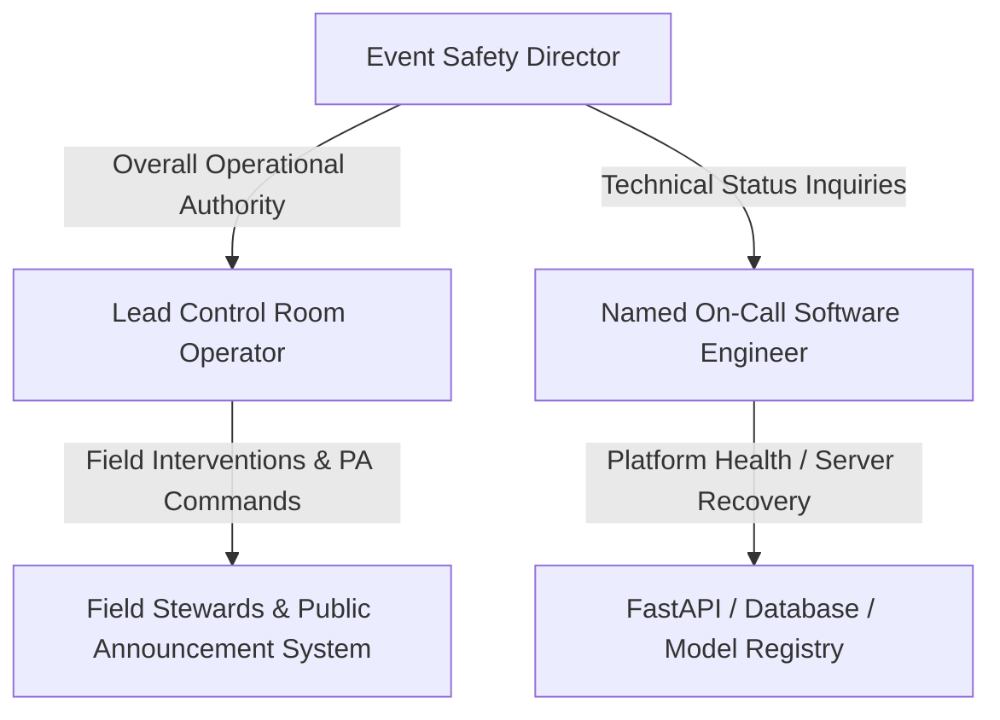

# 🚨 CrowdShield — Platform Incident Response Runbook

**Document Owner**: CrowdShield Safety Operations & Engineering  
**Target Audience**: Control Room Operators, Venue Safety Directors, On-Call Software Engineers  
**Classification**: Operational Safety-Critical Standard Operating Procedure (SOP)  
**Last Updated**: 2026-08-11  

---

## 1. Incident Severity Definitions & Failover Escalation

| Severity Level | Definition | Technical Trigger | Primary Action | Target RTO |
| :--- | :--- | :--- | :--- | :--- |
| **SEV-3 (Minor)** | Single camera stream dropped / single zone degraded | Telemetry age $> 30\text{s}$ in 1 zone | Degraded warning badge shown for Zone X. Operator shifts to direct visual check of Zone X CCTV / stewards. | $< 30\text{ seconds}$ |
| **SEV-2 (Major)** | AI Engine inference failure / Database connection lost | `/health` status = `DEGRADED` | Deterministic safety net rules engage. On-call engineer notified via automated alert. System displays *"MANUAL JUDGMENT ACTIVE"*. | $< 60\text{ seconds}$ |
| **SEV-1 (CRITICAL)**| Total platform / server crash or network blackout | Unresponsive backend / WebSocket disconnect | **FAILOVER TO MANUAL RADIO & PA PROCEDURES IMMEDIATELY.** Venue Safety Director assumes direct manual control. | **$< 60\text{ seconds}$ (Immediate)** |

---

## 2. Chain of Command & On-Call Roles



* **Event Safety Director**: Overall authority for public safety decisions. Authorizes manual crowd evacuation or gate closures if software fails.
* **Lead Control Room Operator**: Manages physical crowd surveillance. Reverts to two-way VHF radio channels if dashboard becomes unavailable.
* **Named On-Call Software Engineer**: Phone: `+1-800-555-CROWD`. Responsible for server reboots, model rollbacks (`rollback_model()`), and network diagnostics.

---

## 3. Step-by-Step Manual Failover Protocol (SEV-1 Blackout)

If the CrowdShield dashboard experiences a total connection drop or server failure:

### Step 1: Immediate Loud Notification ($t = 0\text{s}$)
* Lead Operator announces verbally in Control Room: **"CROWDSHIELD SYSTEM OFFLINE — SWITCHING TO MANUAL RADIO PROTOCOL ALPHA."**
* Operator confirms visual reconnect status banner on screen.

### Step 2: Switch to VHF Radio Channel 1 ($t \le 15\text{s}$)
* Control Room Lead tunes two-way radio to **VHF Channel 1 (Crowd Safety Direct)**.
* Contact Gate Supervisors at Entry Gates 1–4 and Request manual verbal density estimates:
  > *"Control Room to Gate 1 Supervisor: Report visual crowd density and queue tailback status."*

### Step 3: Manual Public Announcement Override ($t \le 30\text{s}$)
* If high density was observed prior to outage, operator uses physical PA Microphone Desk to broadcast pre-scripted announcement manually:
  > *"Attention all attendees: Please maintain a steady pace and utilize all available exit concourses. Follow instructions from field stewards."*

### Step 4: Technical Diagnostics & Instant Rollback ($t \le 3\text{ minutes}$)
* On-Call Engineer inspects `/health` endpoint and terminal logs.
* If crash was caused by a new model artifact deployment, execute instant rollback command:
  ```bash
  python -c "from app.ai.training.registry import rollback_model; rollback_model()"
  ```
* Restart backend service via process supervisor (`pm2 restart crowdshield-backend` or `systemctl restart crowdshield`).

---

## 4. Post-Incident Triage & Audit Protocol

Following any SEV-1 or SEV-2 incident during a live event:
1. Preserve PostgreSQL database state and audit logs (`app.models.AuditLog`).
2. Export JSON system logs to `/artifacts/incident_logs_<timestamp>.json`.
3. Conduct a post-event debrief within 24 hours with the Event Safety Director, Lead Operator, and Engineering Lead.
