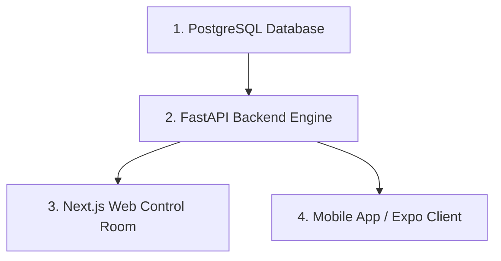

# 🛡️ CrowdShield Platform Runbook

This runbook provides complete instructions to set up, configure, and launch the CrowdShield platform components locally from scratch.

---

## 🏗️ Architecture & Component Overview

1. **FastAPI Backend (`/backend`)**: Core REST API, XGBoost Risk Engine, Supabase Auth Integration, FCM Push Notifications.
2. **Next.js Web Control Room (`/web`)**: Real-time Operator Dashboard, Event & System Administration, Leaflet & OpenStreetMap Visualizations.
3. **Expo / React Native Mobile App (`/mobile`)**: Citizen Emergency Reporting and Field Officer Dispatch Roster interface.

---

## 📋 Prerequisites

- **Python**: `3.10` or `3.11`
- **Node.js**: `v18.x` or `v20.x` (`npm v9+`)
- **PostgreSQL**: `v14+` (Local or Supabase Cloud Instance)

---

## 🚀 Execution Order (Cold Start)

To ensure all dependent services establish connections smoothly, launch services in the following order:



---

## 1. Backend Setup (`/backend`)

### Environment Variables & Local Setup
1. Copy `.env.example` to `.env` inside `backend/` (and root / `web/.env.local` / `mobile/.env`):
   ```bash
   cp .env.example .env
   ```
2. Fill in real local/Supabase credentials in `.env` (never commit `.env`).
3. Verify environment loading & Supabase connectivity:
   ```bash
   python scripts/check_env_config.py
   ```
4. Configuration variables structure (`backend/.env`):
   ```env
   ENV=development
   HOST=0.0.0.0
   PORT=8000
   CORS_ALLOWED_ORIGINS=http://localhost:3000,http://localhost:8000,http://127.0.0.1:3000

   # Database Connection (SQLite default for local dev, PostgreSQL for production)
   DATABASE_URL=sqlite:///./crowdshield.db

   # Supabase Auth & Service Credentials (Fill locally)
   SUPABASE_URL=https://<your-project>.supabase.co
   SUPABASE_ANON_KEY=<your-anon-key>
   SUPABASE_SERVICE_ROLE_KEY=<your-service-role-key>
   SUPABASE_JWT_SECRET=<your-jwt-secret>

   # FCM Push Notifications (Optional)
   FIREBASE_CREDENTIALS_PATH=
   ```


### Installation & Launch Commands
```bash
# Navigate to backend directory
cd backend

# Create virtual environment
python -m venv venv

# Activate virtual environment (Windows PowerShell)
.\venv\Scripts\Activate.ps1
# OR (Linux/macOS)
source venv/bin/activate

# Install dependencies
pip install -r requirements.txt

# Seed database with initial zones, gates, and seed users
python -m app.db.seed

# Run FastAPI development server
uvicorn app.main:app --reload --port 8000
```
Backend Swagger API Documentation available at: `http://localhost:8000/docs`

---

## 2. Next.js Web Control Room Setup (`/web`)

### Environment Variables (`web/.env.local`)
Create a `.env.local` file inside `web/`:
```env
NEXT_PUBLIC_API_URL=http://localhost:8000/api/v1
NEXT_PUBLIC_SUPABASE_URL=https://<your-project>.supabase.co
NEXT_PUBLIC_SUPABASE_ANON_KEY=<your-anon-key>
NEXT_PUBLIC_MAPBOX_TOKEN=pk.eyJ1Ijoic2FtcGxlIiw...
```

### Installation & Launch Commands
```bash
# Navigate to web directory
cd web

# Install Node dependencies
npm install

# Run Next.js development server
npm run dev
```
Web Control Room interface available at: `http://localhost:3000`

---

## 3. Mobile Client Setup (`/mobile`)

### Environment Variables (`mobile/.env`)
Create a `.env` file inside `mobile/`:
```env
EXPO_PUBLIC_API_URL=http://<YOUR_LOCAL_IP>:8000/api/v1
EXPO_PUBLIC_SUPABASE_URL=https://<your-project>.supabase.co
EXPO_PUBLIC_SUPABASE_ANON_KEY=<your-anon-key>
```

### Installation & Launch Commands
```bash
# Navigate to mobile directory
cd mobile

# Install dependencies
npm install

# Start Expo development server
npx expo start
```

---

## 🧪 E2E Integration Verification Test

To verify the full integration loop end-to-end programmatically:
```bash
cd backend
.\venv\Scripts\python.exe tests/test_e2e_flow.py
```
Expected Output:
```
======================================================================
FULL E2E INTEGRATION LOOP PASSED VERIFICATION WITH 0 ERRORS!
======================================================================
```
