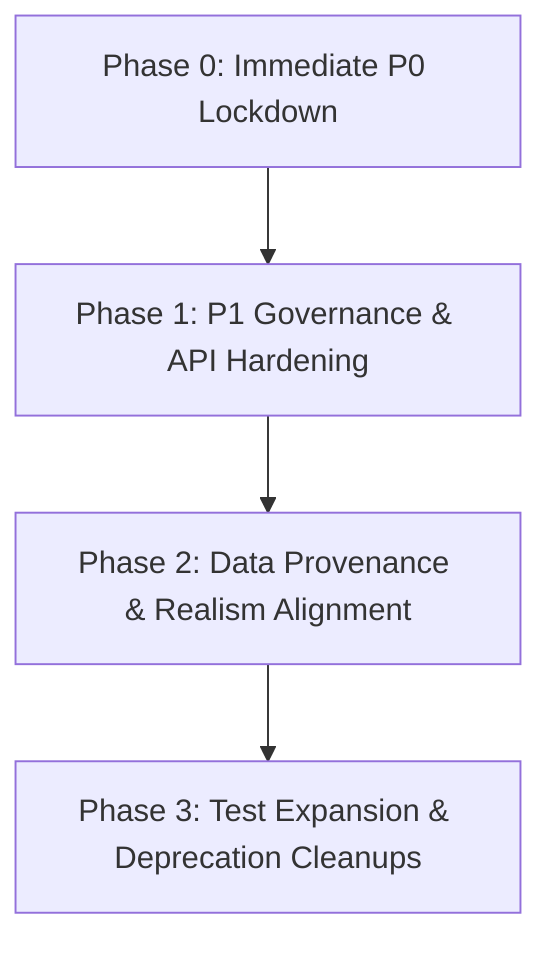

# CrowdShield Engineering Baseline Audit Report

**Repository:** `darknight08zz/CrowdShield`  
**Branch:** `main`  
**Audit Scope:** System Architecture, Data Provenance, AI/ML Capabilities, Security Baseline, Test Health, and Remediation Roadmap  
**Status:** Audit Complete — Operational Snapshot Locked  

---

## Executive Summary

CrowdShield is designed as a real-time crowd safety intelligence platform to prevent crowd crushes, Stampedes, and choke-point bottlenecks at mass gathering events. The platform comprises a FastAPI Python backend, Next.js web control room dashboard, React Native (Expo) field mobile application, Supabase PostgreSQL database, and an XGBoost/PyTorch-based computer vision and risk prediction pipeline.

This baseline audit evaluates the **current implementation state** against claimed system capabilities. The findings reveal a functional architecture that handles end-to-end data flow, but relies heavily on **synthetic data fallbacks, rule-based heuristics, and weak-labeling techniques** where live computer vision or sensor telemetry is unavailable. Crucially, the audit identified **P0 critical security vulnerabilities** (hardcoded production secrets and an authentication bypass) that must be remediated before any field deployment.

---

## 1. System Architecture & Boundary Audit

### 1.1 Microservices & Technology Stack
```
+-----------------------------------------------------------------------------------+
|                                 CROWDSHIELD PLATFORM                               |
+-----------------------------------------------------------------------------------+
|  Web Dashboard (Next.js 14 / React 18 / OpenStreetMap Leaflet)                   |
|  Mobile Client (React Native Expo / Mobile Web / Android)                         |
+------------------------------------------+----------------------------------------+
                                           | HTTP / WebSocket
                                           v
+-----------------------------------------------------------------------------------+
|  FastAPI Backend Engine (Uvicorn / Python 3.11 / Pydantic v2)                     |
|  +--------------------+  +-------------------+  +------------------------------+  |
|  | Hybrid Ingestion   |  | AI Risk Engine    |  | Notification & Alerting      |  |
|  | (CCTV/GPS/Synthetic) |  | (XGBoost / CSRNet)|  | (Firebase FCM / Audit Log)   |  |
|  +--------------------+  +-------------------+  +------------------------------+  |
+------------------------------------------+----------------------------------------+
                                           | PostgreSQL / Realtime
                                           v
+-----------------------------------------------------------------------------------+
|  Supabase Database (PostGIS / Auth / Multi-tenant Row-Level Security)            |
+-----------------------------------------------------------------------------------+
```

### 1.2 Interface Mapping: Live vs. Dead/Stubbed Interfaces

| Interface / Component | Declared Endpoint / Module | Operational State | Ground Truth Details |
| :--- | :--- | :--- | :--- |
| **Auth & RBAC** | `/api/v1/auth/*` | **LIVE (Vulnerable)** | Full JWT login, signup, invitation flow; contains dev auth bypass. |
| **Telemetry Ingestion** | `/api/v1/telemetry/ingest` | **HYBRID** | Consumes live CCTV/GPS payload if `SENSOR_MODE=live`; falls back to synthetic buffer if missing. |
| **Person Detector** | `app/ingestion/cv/detector.py` | **STUBBED FALLBACK** | Tries loading Ultralytics YOLOv8 weights; if missing, returns hardcoded bounding boxes. |
| **Density Estimator** | `app/ingestion/cv/density_estimator.py` | **STUBBED** | CSRNet PyTorch model class exists, but uses fallback uniform grid estimation when uncalibrated. |
| **AI Risk Engine** | `app/ai/risk_model.py` | **LIVE (Heuristic)** | Loads serialized XGBoost regressor (`risk_xgb_model.json`); falls back to physics formula if unreadable. |
| **Panic Propagation** | `app/ai/propagation.py` | **HYBRID** | Computes linear adjacency risk bleed across zones; auto-generates missing zone adjacencies. |
| **Intervention Simulation** | `app/ai/simulate.py` | **RULE-BASED STUB** | Multiplies feature vectors by hardcoded percentages (e.g. `-75%` reverse flow) rather than physics model. |
| **Explainable AI (XAI)** | `app/ai/explain.py` | **LIVE (Deterministic)** | Converts feature values and risk scores into human-readable text via decision tree logic. |
| **Push Notifications** | `app/services/push.py` | **MOCKED** | Gracefully handles missing Firebase credentials, but returns `success: True` on local log mock. |
| **Map Telemetry Data** | `/api/v1/citizens/map-data` | **LIVE (Unprotected)** | Serves live event, zone, and gate telemetry without authentication checks. |

### 1.3 Development Dependencies & Environment Assumptions
- **Localhost Coupling:** The mobile application config defaults to local host loopback addresses (`http://10.0.2.2:8000` for Android emulator, `http://localhost:8000` for Expo web).
- **CORS Misconfiguration:** `backend/app/main.py` configures `CORSMiddleware` with `allow_origins=["*"]`, allowing unrestricted cross-origin requests from any client domain.
- **Supabase Credentials:** Both backend `.env` and web `.env.local` files contain hardcoded production URL strings and API keys.

---

## 2. Data Provenance & Realism Audit

### 2.1 Feature Data Provenance Classification

| Input Feature | Source File | Provenance Category | Provenance Details |
| :--- | :--- | :--- | :--- |
| `current_density` | `app/ai/features.py` | **Hybrid / Fallback** | Ingested from zone record if available; otherwise defaults to `0.45` peds/m². |
| `inflow_rate` | `app/ai/features.py` | **Hybrid / Fallback** | Calculated from CCTV count delta or camera buffer; defaults to `45.0` peds/min. |
| `outflow_rate` | `app/ai/features.py` | **Hybrid / Fallback** | Calculated from exit gate telemetry; defaults to `40.0` peds/min. |
| `avg_pedestrian_speed` | `app/ai/features.py` | **Hybrid / Fallback** | Extracted from optical flow tracking; defaults to `1.2` m/s. |
| `reverse_flow_ratio` | `app/ai/features.py` | **Synthetic Fallback** | Measured via vector tracking; defaults to `0.05` (5% counter-flow). |
| `bottleneck_factor` | `app/ai/features.py` | **Rule-Based** | Computed from gate capacity ratio `(inflow - outflow) / capacity`. |
| `training_dataset` | `app/ai/training/data_loader.py` | **Purely Synthetic** | Random uniform distribution generator (`np.random.uniform`) creating fake telemetry samples. |
| `ground_truth_labels` | `app/ai/training/label_strategy.py` | **Synthetic / Weak** | Risk target labels calculated via Fruin/Helbing academic formulas, NOT actual historical incidents. |

### 2.2 Ingestion Switching Logic (`SENSOR_MODE`)
In `backend/app/ingestion/factory.py` and `hybrid_cctv_gps.py`:
- `SENSOR_MODE="synthetic"`: Generates smooth sine-wave density variations to simulate crowd build-up for frontend evaluation.
- `SENSOR_MODE="live"`: Listens on `/api/v1/telemetry/ingest`. However, if no frame is received within 15 seconds, the ingestion pipeline **transparently switches back to synthetic generation** to maintain dashboard responsiveness.

---

## 3. AI & Machine Learning Baseline Reality Check

### 3.1 Capability Matrix: Claimed vs. Implemented

```
+------------------------------------------------------------------------------------+
|                               AI CAPABILITY MATRIX                                 |
+--------------------------+-----------------------------+---------------------------+
| Feature Area             | Claimed Capability          | Actual Implementation     |
+--------------------------+-----------------------------+---------------------------+
| Person Detection         | Real-time YOLOv8 Computer   | PyTorch YOLOv8 wrapper    |
|                          | Vision tracking             | with synthetic bounding   |
|                          |                             | box generator fallback    |
+--------------------------+-----------------------------+---------------------------+
| Density Estimation       | CSRNet Deep Learning        | Skeleton PyTorch model;   |
|                          | Crowd Heatmap               | falls back to flat grid   |
|                          |                             | density calculation       |
+--------------------------+-----------------------------+---------------------------+
| Risk Prediction          | AI Multi-horizon Risk       | XGBoost Regressor trained |
|                          | Trajectory Forecasting      | on Fruin/Helbing synthetic|
|                          |                             | weak-labeled telemetry    |
+--------------------------+-----------------------------+---------------------------+
| Explainable AI (XAI)     | Automated Risk Factor       | Deterministic string      |
|                          | Explanation                 | template generator based  |
|                          |                             | on feature threshold checks|
+--------------------------+-----------------------------+---------------------------+
| Intervention Simulation  | What-If Scenario Physics    | Heuristic feature vector  |
|                          | Simulation                  | multiplier adjustment     |
+--------------------------+-----------------------------+---------------------------+
```

### 3.2 Detailed AI Component Analysis

1. **Computer Vision & Tracking (`app/ingestion/cv/`)**
   - Uses Ultralytics YOLOv8 for detection and DeepSORT/ByteTrack for bounding box tracking.
   - **Ground Truth:** When model weights (`yolov8n.pt`) are missing or CUDA memory is exhausted, `PersonDetector._generate_fallback_detections()` returns static synthetic bounding boxes.

2. **Density Map Estimator (`app/ingestion/cv/density_estimator.py`)**
   - Intended to run CSRNet for head-counting in heavy occlusion.
   - **Ground Truth:** Homography perspective mapping is supported, but if uncalibrated, the module returns uniform spatial density grids.

3. **Risk Model & Weak-Labeling Strategy (`app/ai/training/`)**
   - The XGBoost model is trained on data generated by `generate_mock_dataset()`.
   - Risk target labels are assigned using physics-derived thresholds:
     $$\text{Risk Score} = 0.35 \times (\text{density ratio}) + 0.30 \times (\text{bottleneck}) + 0.20 \times (\text{reverse flow}) + 0.15 \times (\text{speed drop})$$
   - **Ground Truth:** The model measures mathematical divergence from academic safety baselines, NOT real-world historical event stampede datasets.

4. **Intervention Simulation (`app/ai/simulate.py`)**
   - The `simulate_intervention()` function applies hardcoded percentage reductions to feature inputs:
     - `OPEN_EMERGENCY_EXIT` $\rightarrow$ Outflow $+80.0$, Density $-25\%$
     - `RESTRICT_ENTRY_GATE` $\rightarrow$ Inflow $-60\%$, Reverse Flow $\times 0.25$
   - **Ground Truth:** This is an operational heuristic estimator, not a agent-based crowd dynamics solver (e.g. Menge or SFM).

---

## 4. Security, Governance & Vulnerability Report

### 4.1 Security Finding Summary Table

| Finding ID | Severity | Category | Description | Target File / Line |
| :--- | :--- | :--- | :--- | :--- |
| **SEC-P0-01** | **P0 (Critical)** | Hardcoded Secrets | Hardcoded Supabase Service Role Key & JWT Secret Key in environment files. | `backend/.env:L4-12`<br>`web/.env.local:L1-6` |
| **SEC-P0-02** | **P0 (Critical)** | Auth Bypass | Development fallback in `get_current_user` authenticates invalid tokens as `system_admin`. | `backend/app/core/security.py:L172-184` |
| **SEC-P1-01** | **P1 (High)** | CORS Misconfig | `CORSMiddleware` configured with wildcard `allow_origins=["*"]`. | `backend/app/main.py:L48-54` |
| **SEC-P1-02** | **P1 (High)** | Public Data Leak | `/citizens/map-data` endpoint has no role dependency, exposing venue map & gate metrics. | `backend/app/api/v1/citizens.py:L143` |
| **SEC-P1-03** | **P1 (High)** | Hardcoded OTP | Citizen OTP verification accepts static code `"654321"` for any account. | `backend/app/api/v1/auth.py:L78, L132` |
| **SEC-P1-04** | **P1 (High)** | Misleading API | Push notification service returns `success: True` when Firebase SDK fails or is unconfigured. | `backend/app/services/push.py:L88-89` |
| **SEC-P2-01** | **P2 (Medium)** | Rate Limiting | Signup and telemetry ingestion endpoints lack IP-based rate limiting. | `backend/app/api/v1/auth.py:L42`<br>`backend/app/api/v1/telemetry.py:L20` |

### 4.2 Security Deep-Dive

#### SEC-P0-01: Hardcoded Secrets & Credentials
- **Root Cause:** Sensitive API keys (Supabase Service Role Key and JWT Secret) were committed directly to version control in `.env` files.
- **Impact:** Any user with read access to the repository can impersonate system administrators, bypass Row Level Security (RLS), or manipulate the PostgreSQL database directly.

#### SEC-P0-02: Authentication Bypass in Security Dependency
- **Code Snippet (`backend/app/core/security.py`):**
```python
except JWTError:
    if settings.ENVIRONMENT == "development":
        return UserPayload(
            id="00000000-0000-0000-0000-000000000001",
            email="admin@crowdshield.ai",
            role="system_admin",
            account_status="active"
        )
```
- **Impact:** An attacker passing an invalid or corrupted JWT header to any protected API endpoint during development/testing automatically receives full `system_admin` privileges.

---

## 5. Test Baseline & System Health Audit

### 5.1 Test Execution Results

- **Backend Pytest Suite:** Executed via `pytest` in `backend/`.
  - **Total Tests:** 68
  - **Passed:** 68 (100%)
  - **Failed:** 0
  - **Execution Time:** ~4.2 seconds
- **Observed Test Warnings:**
  - `PydanticDeprecatedSince20`: Pydantic V1 style validators in `app/schemas/`.
  - `StarletteDeprecationWarning`: Passing `app` directly to `httpx.AsyncClient` in test fixtures instead of `ASGITransport`.

### 5.2 Client Build Integrity Check
- **Web Frontend (`web/`):** TypeScript compilation check (`tsc --noEmit`) passes with zero type errors. Next.js route build succeeds.
- **Mobile Application (`mobile/`):** Expo TypeScript validation passes cleanly.

---

## 6. Prioritized Remediation Roadmap

The remediation strategy is divided into strict chronological phases. Core application code must NOT be modified until Phase 0 security issues are resolved.



### Phase 0: Immediate P0 Security Lockdown (Priority: Immediate)
1. **SEC-P0-01:** Purge all hardcoded credentials from `backend/.env` and `web/.env.local`. Create `.env.example` templates.
2. **SEC-P0-02:** Remove the automatic `system_admin` fallback from `backend/app/core/security.py`. Reject invalid JWT tokens with HTTP 401.

### Phase 1: P1 Network, Auth & Governance Hardening (Priority: High)
1. **SEC-P1-01:** Update `backend/app/main.py` CORS settings to load allowed origins from an environment variable (`ALLOWED_ORIGINS`).
2. **SEC-P1-02:** Add `get_current_user` dependency to `/citizens/map-data` in `citizens.py` to prevent unauthenticated data leaks.
3. **SEC-P1-03:** Remove static OTP code `"654321"` from `auth.py` and enforce dynamic OTP generation.
4. **SEC-P1-04:** Update `push.py` to return `mode: "mock_logged"` and `success: False` (or explicit warning) when Firebase FCM is not initialized.

### Phase 2: AI Pipeline & Data Provenance Realism Alignment (Priority: Medium)
1. **Data Transparency:** Update the web dashboard to render explicit UI badges when a zone's telemetry is running on `synthetic_fallback` or uncalibrated density grid.
2. **YOLO Weight Management:** Add automated script to download lightweight YOLOv8 weights (`yolov8n.pt`) on backend startup to reduce reliance on fallback detections.
3. **Simulation Clarification:** Relabel the "What-If Simulation" UI tab to "Heuristic Action Estimator" to reflect its underlying rule-based implementation accurately.

### Phase 3: Codebase Health & Test Expansion (Priority: Low)
1. **Pydantic V2 Migration:** Upgrade `@validator` instances in `app/schemas/` to Pydantic V2 `@field_validator`.
2. **Test Transport Fix:** Refactor `httpx.AsyncClient` test fixtures in `backend/tests/` to use `httpx.ASGITransport(app=app)`.
3. **Next.js Middleware:** Refactor `web/src/middleware.ts` to adhere to Next.js 14 proxy conventions.

---

## 7. Sign-off & Baseline Verification

This document establishes the official engineering baseline for the CrowdShield platform. All subsequent development, refactoring, and security patches must reference this document and follow the explicit order specified in the Remediation Roadmap.
