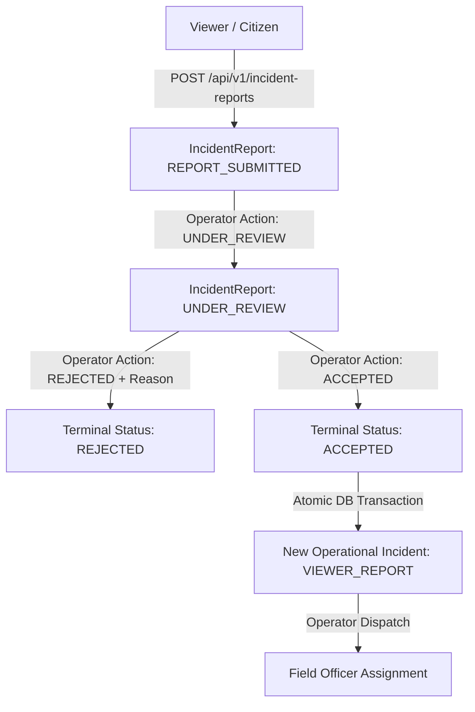

# CrowdShield — Role-Based Access Control & Incident Reporting Architecture

## 1. Overview & Architectural Philosophy

CrowdShield enforces a strict, fail-closed **Role-Based Access Control (RBAC)** model to safeguard operational command integrity during high-density event monitoring.

A fundamental design principle of CrowdShield is the strict separation between:
1. **Operational Incidents (`Incident`)**: Real-time safety events generated primarily by the high-throughput AI computer vision/temporal forecasting inference pipeline, or created directly by operators. Operational incidents trigger real-time alert broadcasts, field officer dispatch workflows, and physical venue interventions.
2. **Citizen/Viewer Reports (`IncidentReport`)**: Human-submitted observations reported by viewers or attendees via web/mobile clients. Viewer reports are untrusted candidate inputs that enter a dedicated review workflow (`REPORT_SUBMITTED` -> `UNDER_REVIEW` -> `ACCEPTED`/`REJECTED`) and **never** directly mutate operational incident state or trigger automated dispatches.

---

## 2. Role Capability Matrix

CrowdShield defines four canonical, normalized roles enforced at every API boundary:

| Capability / Resource | ADMIN (`admin`, `system_admin`, `event_admin`) | OPERATOR (`operator`) | FIELD_OFFICER (`field_officer`) | VIEWER (`viewer`, `citizen`) |
| :--- | :---: | :---: | :---: | :---: |
| **System Admin / User Management** | ✅ | ❌ | ❌ | ❌ |
| **Venue / Event Configuration** | ✅ | ❌ | ❌ | ❌ |
| **Audit Logs Access** | ✅ | ❌ | ❌ | ❌ |
| **View Realtime Telemetry & Map** | ✅ | ✅ | ❌ | ❌ |
| **Manage Operational Incidents (Transitions)** | ✅ | ✅ | ❌ | ❌ |
| **Dispatch Field Officers** | ✅ | ✅ | ❌ | ❌ |
| **Review & Accept/Reject Incident Reports** | ✅ | ✅ | ❌ | ❌ |
| **View Assigned Dispatches & Transition Own Status** | ✅ | ✅ | ✅ (Own Only) | ❌ |
| **Submit Incident Report** | ✅ | ✅ | ✅ | ✅ |
| **View Own Submitted Reports** | ✅ | ✅ | ✅ | ✅ (Own Only) |

### Fail-Closed Enforcement Principles
- **Default Deny**: Any request lacking explicit role authorization returns `HTTP 403 Forbidden` (or `401 Unauthorized` if unauthenticated).
- **Zero Viewer Operational Access**: A user with `VIEWER` role cannot transition incident states, dispatch officers, view audit logs, or review other users' reports.

---

## 3. Operational Incident vs. Viewer IncidentReport

To preserve AI pipeline integrity and prevent false-positive operational chaos, human reports are isolated from operational incidents:

### Key Distinctions

| Feature / Property | `Incident` (Operational) | `IncidentReport` (Viewer Submitted) |
| :--- | :--- | :--- |
| **Primary Origin** | AI Ingestion & Inference Pipeline (`SYSTEM_AI`) | Human Viewer Submission (`VIEWER`) |
| **Primary ID Format** | `INC-YYYYMMDD-XXXXXX` (UUID string) | `REP-YYYYMMDD-XXXXXX` (UUID string) |
| **State Machine** | `OPEN` -> `ACKNOWLEDGED` -> `INVESTIGATING` -> `MITIGATING` -> `RESOLVED` / `FALSE_POSITIVE` | `REPORT_SUBMITTED` -> `UNDER_REVIEW` -> (`ACCEPTED` \| `REJECTED`) |
| **Dispatch Eligible** | Yes (Operators can assign Field Officers) | No (Must be accepted first) |
| **Data Integrity** | Linked to YOLOv8/ByteTrack/v2.0.0 Temporal AI risk metrics | Untrusted user observation text + optional media |

---

## 4. AI Provenance vs. Human Provenance

Every operational incident maintains strict scientific provenance metadata to guarantee technical honesty and traceability:

- **AI-Detected Incidents (`source_type = "AI_EARLY_WARNING_PROXY"`)**:
  - `model_version`: `v2.0.0`
  - `model_status`: `PROTOTYPE`
  - `ground_truth_status`: `NOT_CLINICALLY_OR_OPERATIONALLY_VALIDATED`
  - Contains quantitative telemetry (`warning_state_at_creation`, `physics_risk_at_creation`, `ai_probability_at_creation`).

- **Human-Submitted Incidents (`source_type = "VIEWER_REPORT"`)**:
  - `model_version`: `v2.0.0`
  - `prediction_target`: `HUMAN_REPORTED_INCIDENT`
  - `label_type`: `HUMAN_SUBMITTED_OBSERVATION`
  - `generalization_status`: `HUMAN_VERIFIED_REPORT`
  - `disclaimer`: `"Human-Submitted Viewer Report accepted by operator. Not generated by AI models."`
  - Linked to originating report via `accepted_incident_id`.

---

## 5. API Security Contracts

### Incident Reporting Endpoints

| Endpoint | Method | Allowed Roles | Description |
| :--- | :---: | :--- | :--- |
| `/api/v1/incident-reports` | `POST` | All Authenticated Users (`VIEWER`, `OPERATOR`, `ADMIN`) | Submit a new human incident report (`REPORT_SUBMITTED`) |
| `/api/v1/incident-reports/my` | `GET` | All Authenticated Users | List incident reports submitted by current session user |
| `/api/v1/operator/incident-reports` | `GET` | `ADMIN`, `OPERATOR` | List pending/all incident reports for operational review |
| `/api/v1/operator/incident-reports/{id}` | `GET` | `ADMIN`, `OPERATOR` | View detailed report content and review history |
| `/api/v1/operator/incident-reports/{id}/review` | `POST` | `ADMIN`, `OPERATOR` | Review report (`UNDER_REVIEW`, `ACCEPTED`, `REJECTED`) |

---

## 6. Immutable Audit Logging

All incident reporting actions emit structured audit records to the `audit_logs` table:

- `INCIDENT_REPORT_CREATED`: Emitted when a report is submitted by a user.
- `INCIDENT_REPORT_REVIEW_STARTED`: Emitted when an operator sets status to `UNDER_REVIEW`.
- `INCIDENT_REPORT_ACCEPTED`: Emitted when an operator accepts a report.
- `INCIDENT_CREATED_FROM_VIEWER_REPORT`: Emitted atomically when the operational `Incident` is generated from an accepted report.
- `INCIDENT_REPORT_REJECTED`: Emitted when an operator rejects a report (includes required `review_reason`).

Every audit log entry preserves `actor_id`, `actor_role`, `resource_type`, `resource_id`, `request_id` (`X-Request-ID`), and state diffs.
